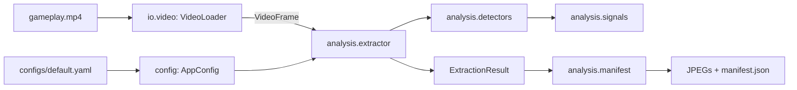

# splatoon3-ai-coach

An extensible Python application for analyzing Splatoon 3 gameplay video and
producing evidence-based coaching.

## Setup

```bash
python3 -m venv .venv
.venv/bin/pip install -e ".[dev]"
```

## Commands

```bash
s3-coach inspect path/to/gameplay.mp4
s3-coach extract path/to/gameplay.mp4 --out ./frames/
s3-coach extract path/to/gameplay.mp4 --out ./frames/ --config ./configs/default.yaml
```

`inspect` prints container metadata. `extract` writes JPEG evidence frames plus
a `manifest.json` recording each frame's timestamp, event type, confidence,
source frame index, and path.

## Project layout

The package is organized by pipeline stage, so each directory owns one step of
the flow from video file to manifest.

```text
src/splatoon3_ai_coach/
├── config/     schema and YAML loading for every tunable value
├── io/         video decoding (the only module that touches PyAV)
├── analysis/   signals -> detectors -> extractor -> manifest
└── cli/        one module per command, wiring the stages together
```



Inside `analysis/`, the layers are deliberately separate:

- `signals.py` measures raw numbers between two frames and makes no decisions
- `detectors.py` applies configured thresholds and scores how far a signal
  cleared its threshold
- `extractor.py` walks the video, decimates to `analysis_fps`, and decides
  which frames to keep
- `manifest.py` is the only place that writes to disk

## How extraction works

The extractor does not save every Nth frame. It decodes the video, runs
detectors at a lower analysis rate, and keeps a frame only when something
crosses a threshold:

- scene changes, from histogram difference and structural similarity
- HUD-region changes for killfeed, special gauge, objective timer, and death UI
- motion, from optical flow
- an initial keyframe

Each kept frame produces an `Event` that records every detector that fired, the
strongest one as its type, and a context window derived from
`context_before_seconds` / `context_after_seconds`.

### Configuration

All values live in `configs/default.yaml` and are validated into typed models on
load, so a malformed HUD region or an out-of-range threshold fails immediately
with a clear message rather than midway through a long run.

- `analysis_fps` controls how often detectors run, not how often frames are
  saved. Running optical flow against every frame of a 60 FPS source is
  unnecessary for candidate-event detection.
- `min_event_gap_seconds` suppresses repeat events in quick succession.
- `max_frames_per_minute` caps retained frames over any trailing 60 seconds.
- `video.max_width` / `video.max_height` bound decoded frames before analysis.

### Important limitation

The HUD detectors are **change detectors**, not semantic Splatoon detectors. A
death-region detection is evidence that the region changed; it does not claim
the word "Splatted!" was recognized, and a special-gauge detection does not
prove the gauge filled.

Those semantic interpretations need template matching and OCR calibrated
against real Splatoon HUD screenshots. Keeping the distinction explicit
prevents the extractor from presenting generic image changes as game facts.

## Development

```bash
.venv/bin/pytest
.venv/bin/ruff check .
.venv/bin/ruff format .
```
