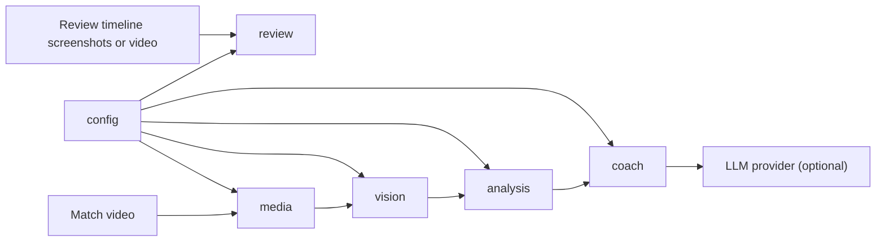
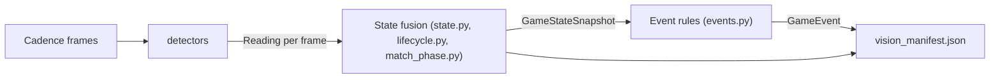

# Architecture overview

A short map of how a video becomes coaching. The authoritative rules and
vocabulary live in [AGENTS.md](../AGENTS.md); this page is the orientation tour.

## Pipeline

Dependencies point one way. A later stage may import an earlier one, never the
reverse.

| Stage | Package | Input → output |
|-------|---------|----------------|
| Config | `config/` | `configs/default.yaml` + `S3_COACH_*` env → typed `AppConfig` |
| Media | `media/` | Video file → decoded frames with timestamps, video identity |
| Vision | `vision/` | Frames → per-frame `Reading`s → fused `GameStateSnapshot`s → `GameEvent`s, persisted as `vision_manifest.json` |
| Analysis | `analysis/` | Events + snapshots → `GameSession`, `Scenario`s, `ScenarioContext` evidence |
| Coach | `coach/` | One scenario at a time → `CoachInput` → prompts → optional LLM `CoachingAssessment` |
| Review | `review/` | Review timeline images (or a video adapted into images) → elapsed-clock-indexed `ReviewTimelineDataset` |
| Extraction | `extraction/` | Optional debug JPEG dumps; **not** used by `analyze` |
| CLI | `cli/` | Thin Typer commands that call the stage pipelines |

## Inside the vision stage

- **Detectors** (`vision/<thing>.py`, registered in `vision/registry.py`) only
  look at one frame and report evidence. They never decide "the player died".
- **Fusion** turns noisy readings into state (match phase, player lifecycle,
  roster counts, score) with debouncing.
- **Event rules** emit one-shot facts (`DEATH`, `SPLAT`, `RESPAWN`, …) from
  state transitions only.
- `s3-coach refuse` re-runs fusion and events from stored readings without
  decoding the video, which makes fusion changes cheap to evaluate.

## Evidence layers

| Layer | Question it answers | Lives in |
|-------|---------------------|----------|
| Scenario | Which events belong together? | `analysis/scenarios.py` (frozen) |
| ScenarioContext | What was observed around them? | `analysis/scenario_context.py` and `*_context.py` |
| Coaching | What does it mean for the player? | `coach/` + LLM |

Coaching may only interpret evidence; it may not invent it. The contract is in
[`coach/EVIDENCE_CONTRACT.md`](../src/splatoon3_ai_coach/coach/EVIDENCE_CONTRACT.md)
and enforced by `tests/test_coach_evidence_contract.py`.

## Two clocks

- **Video time** (seconds into the file) orders and groups everything in the
  main pipeline.
- **Game clock** (the on-screen timer) is secondary coaching evidence only.
- The Review stage uses the rendered **elapsed** clock (`elapsed_seconds`) as
  its only temporal key; video time there is provenance.

## Where to look first

| I want to… | Start at |
|------------|----------|
| Add or fix a detector | `vision/registry.py`, an existing detector such as `vision/death.py`, and "Adding a vision detector" in AGENTS.md |
| Change how state is fused | `vision/state.py`, `vision/lifecycle.py` |
| Add scenario evidence | `analysis/scenario_context.py` (read the evidence freeze in AGENTS.md first) |
| Change prompts or LLM calls | `coach/prompts/`, `coach/llm_client.py`, `cli/coach_prototype.py` |
| Work on Review timeline import | `review/timeline_pipeline.py`, `review/video_adapter.py` |
| Add a config option | `config/models.py` and `configs/default.yaml` |
| Debug a run visually | `s3-coach vision-view <manifest>` |
